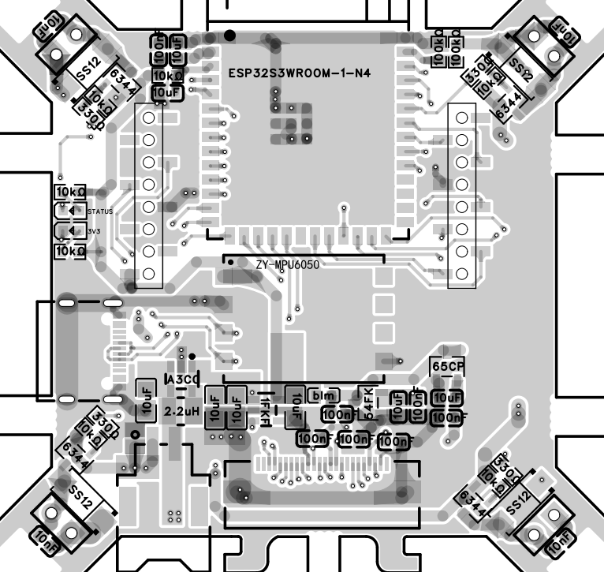

# Tiny-Drone Open-Source Micro Drone

[简体中文](README.md) | **English**

> An open-source ESP32-S3 micro drone supporting Android app, mobile browser, and remote-controller operation, plus Wi-Fi video transmission and Remote ID broadcasting.

  

## Overview

Tiny-Drone is an ESP32-S3-based micro drone. Its main codebase is derived from the open-source [ESP-Drone](https://github.com/espressif/esp-drone) project and is distributed under the [GPL-3.0 License](LICENSE). The [hardware design is also open source](https://oshwhub.com/xiaochen_study/project_wsijdhkn).

Key features:

- Android app control
- Mobile browser control
- Remote-controller support
- Wi-Fi video transmission
- Remote ID broadcasting
- Expansion support for a barometer, laser ranging sensor, and position-hold module

## Video Demonstrations

- [Indoor flight](https://www.bilibili.com/video/BV1T7th6gEEx/)
- [Assembly tutorial](https://www.bilibili.com/video/BV1CBtU6UEvK/)

## Important Notes

> [!IMPORTANT]
> Before flying outdoors, program a unique product serial number, complete the required registration, and then enable Remote ID. Always comply with local drone regulations.

- Minor horizontal lines may appear in the Wi-Fi video feed, especially when battery voltage is low.
- If the yaw angle drifts, adjust the motor height and propeller installation depth.
- Before using altitude hold, make sure the propellers and motors are correctly installed and aligned. Incorrect alignment may cause unstable flight.
- Support the bottom of the motor by hand when installing a propeller. Excessive force may push through the rear cover and detach the motor.

## Hardware Design

### Power Supply

The drone uses a lithium battery. A boost converter raises the battery voltage, and an LDO supplies regulated power to the sensors and main controller.

  

### Status and Power LEDs

  

### Sensor

A ZY-MPU6050 module is used to make manual soldering easier.

  

### Main Controller and ADC Battery Measurement

  

### Motor Drivers

  

### Camera

  

### Expansion Modules

The board supports an SPL06-001 barometer and a VL53L1X sensor for altitude hold. An interface is reserved for a position-hold module.

  

## Software and Control Interfaces

After powering on the drone, connect your phone to the Wi-Fi network `TINY-DRONE_XXXXXXXXXXXX` using the password `87654321`.

- Drone firmware: [Tiny-Drone](https://github.com/jonny-lekaiwu/Tiny-Drone)
- Android app: [ESP-Drone-Android](https://github.com/jonny-lekaiwu/ESP-Drone-Android)
- Scan the QR code to download the Android app:

  

    
  

On an iPhone, open `192.168.43.42` in a browser to control the drone. A native iOS app is planned according to demand.

  

<em>Android app control interface</em>

  

<em>Mobile browser control interface</em>

## Hardware Gallery

## Building Your Own Drone

Prepare medium-temperature solder paste and a hot plate before assembly to speed up soldering.

### Hardware Assembly

  

1. **Prepare the components**

   Purchase the required components according to the BOM, or buy a complete [component kit](https://item.taobao.com/item.htm?ft=t&id=1080586148318). Use good-quality parts because poor-quality components may affect flight performance. Seller-tested ZY-MPU6050 and OV2640 modules are recommended.

   

     
   

2. **Order the PCB**

   Open the project in JLCEDA, export the PCB, and order it from JLCPCB. Select a thickness of **1.6 mm**; otherwise, gaps may remain between the rubber rings and PCB, making the motors difficult to secure.

3. **Solder the components**

   - Use a ZY-MPU6050 module instead of a bare MPU6050 to support hand soldering.
   - Use a small knife-tip USB soldering iron for the FPC connector. Remove solder bridges with flux and a dragging motion.
   - For the 16-pin USB Type-C connector, use medium-temperature solder paste and a compact knife-tip soldering iron.
   - SMT reference:

     

### Building and Flashing

- Built with ESP-IDF v5.5.3.
- Download the Windows version of [ESP-IDF](https://dl.espressif.cn/dl/esp-idf/?idf=5.5.3).

  

~~~shell
./build.bat tiny-drone
idf.py flash monitor -p COMX
~~~

Replace `COMX` with the serial port assigned to the drone.

### One-Click Flashing

1. Open the online [ESP Web Tools flasher](https://espressif.github.io/esptool-js/).
2. Connect to and open the detected COM port.

   

3. Select the firmware file and set its flash address to `0`.

   

4. Start flashing and wait for it to finish.

   

### Adjusting Motor Position and Propeller Depth

#### Motor Position

Leave a small gap between each motor and its mount to protect the motor during a collision.

  

#### Motor Angle

Each motor should be perpendicular to the horizontal plane to avoid noticeable yaw drift.

  

#### Propeller Depth

Leave approximately **2 mm** between each propeller and motor.

  

## Troubleshooting

<strong>The throttle does not respond after power-on</strong>

Check whether the status LED is blinking slowly. The MPU6050 may have failed its self-test. Also ensure that the drone remains level during initialization.

<strong>The throttle no longer responds after a collision</strong>

The drone may have detected a fall and entered emergency-stop mode. Restart it.

<strong>The camera does not respond</strong>

Check the logs to confirm that the camera initialized successfully. Inspect each signal connection for poor solder joints and check for shorts to GND, 3.3 V, or adjacent signal lines.

<strong>The drone consistently yaws to one side after takeoff</strong>

If it yaws to the right, the left-side motors may be too high. Lower the left-side motors or slightly raise the right-side motors.

<strong>One propeller does not spin after takeoff</strong>

The motor may be damaged, or an internal wire may be broken. Replace the motor. If the issue remains, reflow the corresponding MCU signal connections and check for cold solder joints.

<strong>The propellers spin, but the drone cannot take off</strong>

Check that every propeller has the correct type, orientation, and installation position.

  

